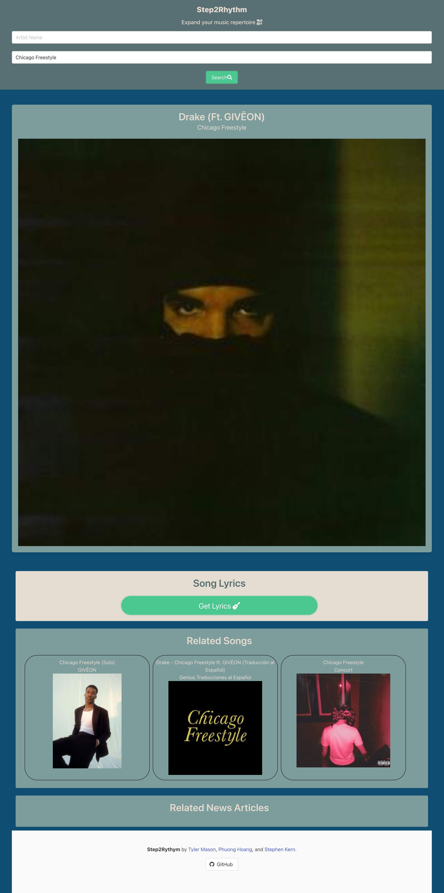

# Step2Rythym
An app to search for lyrics, related songs and news to your new favorite songs!

## How this works:
Users can utilize this app to:
(1) Put in artist+song name to find the song lyrics
(2) The same search combo will generate related news based on the artist's name

## User story:
As an avid music lover, I want to build an app that allows us to search for song lyrics and song news, so that I can easily immerse myself in music and expand my music repertoire

## Website set-up:
### Search bar: 
Where user can input two criterias, "Artist's Name" and "Song Name", to pull up song lyrics. The same search also generates related news article based on artists. 

### Song information section: 
Where the search result will go. Header will show Artist's Name& Song Name. Album art will also display in this section

### Song lyrics section: 
Includes a "Get Lyrics" button, where it will take you to the song lyrics once clicked

### Related songs/news: 
The search will pull up related songs and news

## How the page looks:

## Link: https://stephen-kern.github.io/Step2Rythym/

